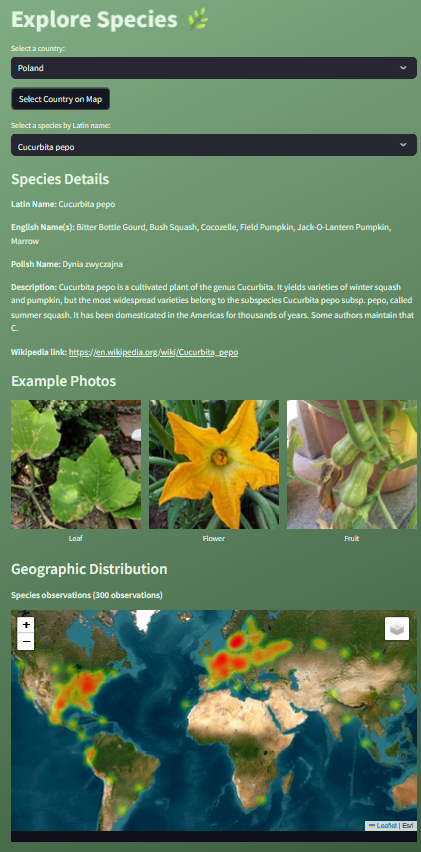
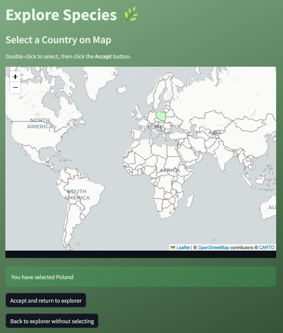

# Plant Explorer 🌱

A Streamlit-based interactive application for **plant species recognition** and exploration using deep learning.

---

## About the App

Plant Explorer allows users to:

- Upload a plant image (typically a leaf, flower) and get an automated species prediction using a pretrained EfficientNet-B0 model.
- Explore detailed information about different plant species, including their Latin names, common English and Polish names, descriptions, and example photos of leaves, flowers, and fruits.
- Visualize the geographic distribution of species observations on an interactive heatmap.
- Filter species by country or select countries on an interactive world map.

---

## Features

- **Image-based Plant Species Prediction:** Upload an image and receive an immediate species name with detailed information.
- **Species Explorer Mode:** Browse species data, filter by country, and visualize distribution.
- **Interactive Map:** Select countries on a world map to filter species native to that region.
- **Visual Heatmaps:** See species observations mapped globally with Folium-powered heatmaps.
- **Clean, green-themed UI** designed using Streamlit's customization options.

---

## Screenshots

### Upload & Predict Mode

Upload an image and see the prediction with species info and images.

---

### Species Details View

Detailed plant info including description, photos, and geographic heatmap.

---

### Country Filter & Map Selection

Filter species by country or select a country on the interactive map.

python -m venv venv
source venv/bin/activate   # Windows: venv\Scripts\activate
pip install -r requirements.txt
